#Uploading Documents
This document contains instructions for uploading new documents (Constitution, Membership Form).

##Step 1 - Login to cPanel
Navigate to `http://wrssnewcomers.com/cpanel` and login.
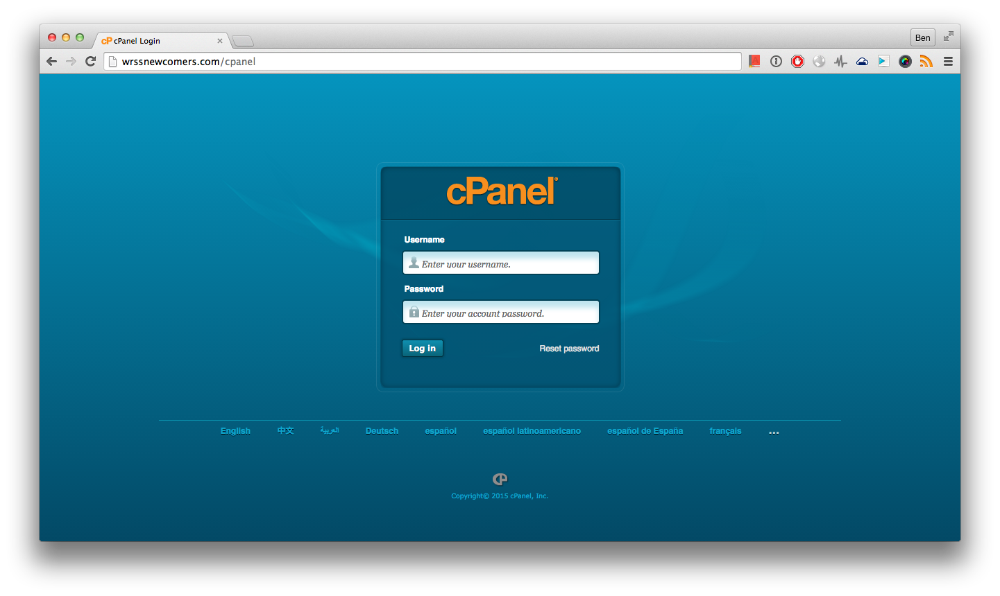

##Step 2 - Open `File Manager`
Scroll down until the `Files` section appears, click on `File Manager`.
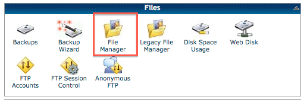

##Step 3 - `public_html`
In the left panel, select `public_html`
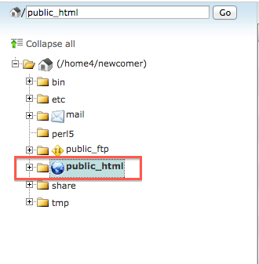

##Step 4 - `docs` folder
1. On the right, double click `docs`
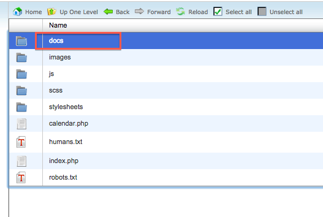

##Step 5 - Upload Button
You can now see the two documents, `Constitution.pdf` and `Membership_Application.pdf` on the right. Click `Upload` to upload new versions
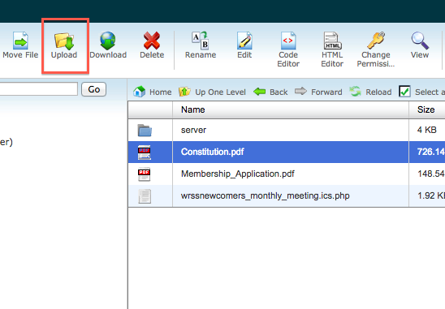

*Note:* The files you upload must match the file names in the directory(case sensitive.) The default files are `Constitution.pdf` and `Membership_Application.pdf`

##Step 6 - Upload Page
1. Click on `Choose File`
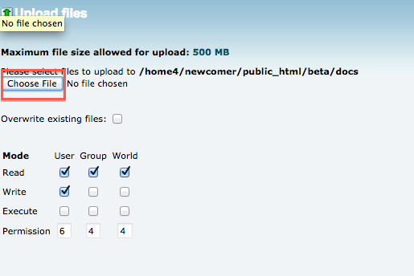
2. Choose a file when prompted and click `Open`
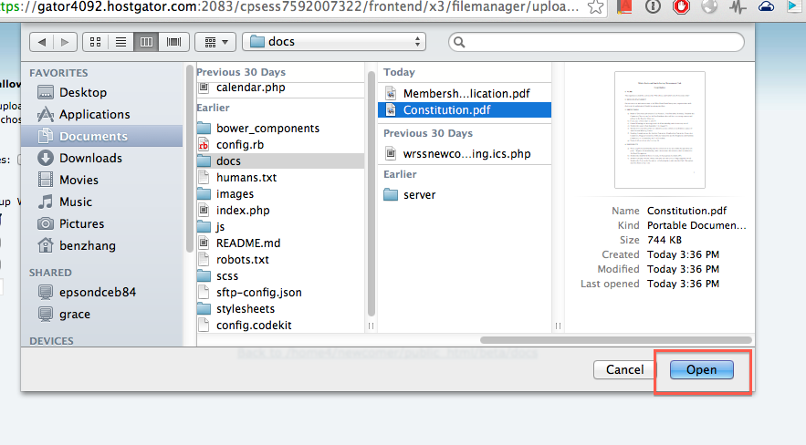
3. Select `yes` when it asks whether or not to overwrite the existing file
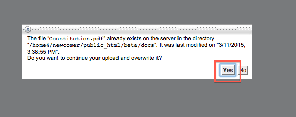

##Step 7 - Uploading
The upload should finish in a few seconds
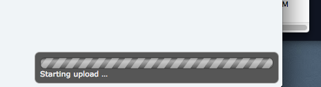
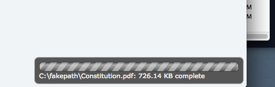

##Step 8 - Finishing Up
1. Click the `Back to ...` link
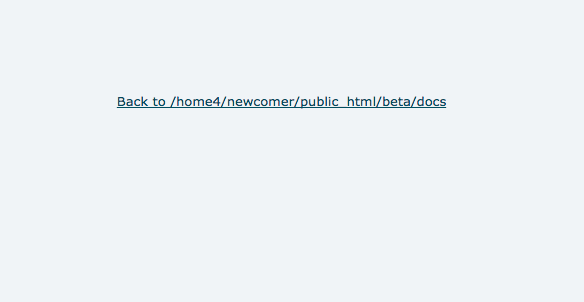

2. You should see that the `Last Modified` time has changed
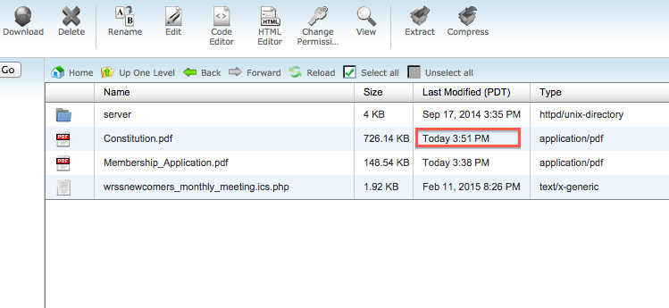
