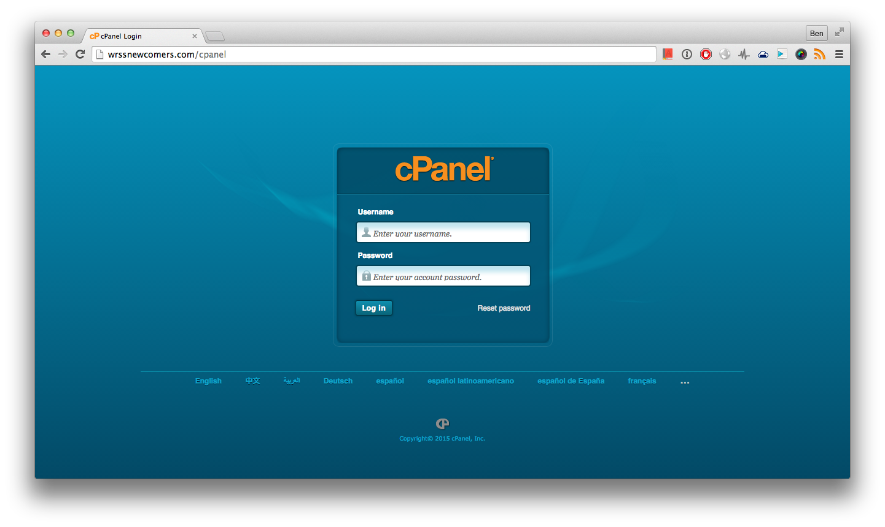
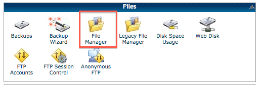
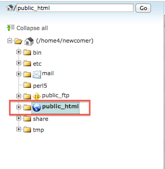
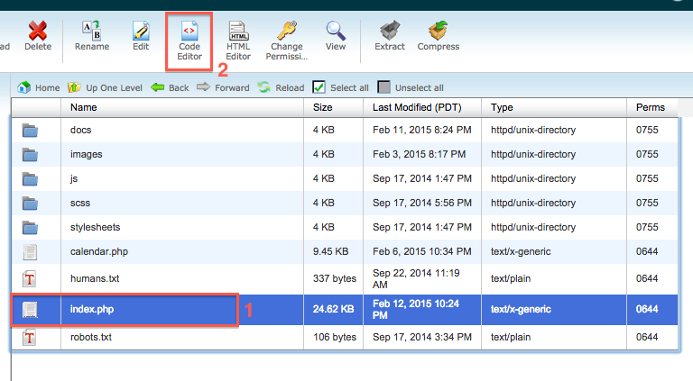
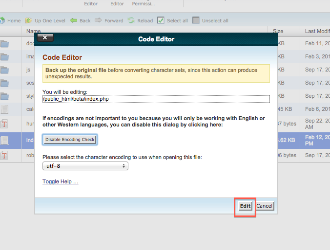
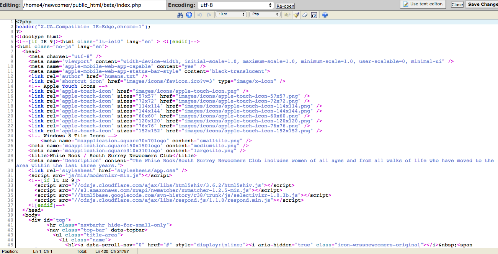
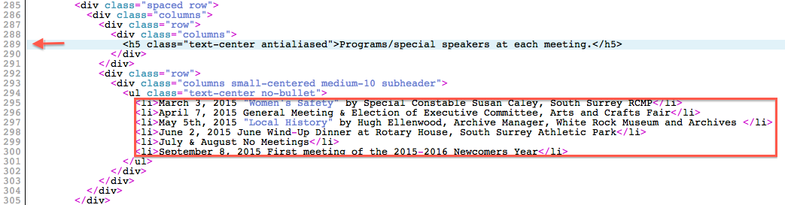
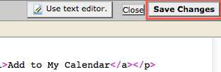
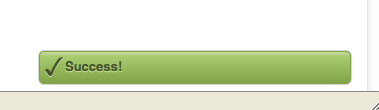
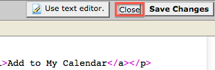

#Editing Speakers
This document contains instructions for editing the speaker list on the main website

##Step 1 - Login to cPanel
Navigate to `http://wrssnewcomers.com/cpanel` and login.


##Step 2 - Open `File Manager`
Scroll down until the `Files` section appears, click on `File Manager`.


##Step 3 - `public_html`
In the left panel, select `public_html`


##Step 4 - index.php
1. On the right, single click `index.php`
2. Click on `Code Editor` in the top bar.

3. Select `Edit` when prompted


##Step 5 - You will see the contents of the file


##Step 6 - Scroll down and find the section titled `Programs/special speakers at each meeting.` (around line 290)


##Step 7 - Edit the list

**Formatting:**

```html
<li>YOUR_CONTENT</li>
```

##Step 8 - Save changes
1. Click on the `Save Changes` button in the top right corner


2. You will see a `Success!` notification


3. Close the editor

