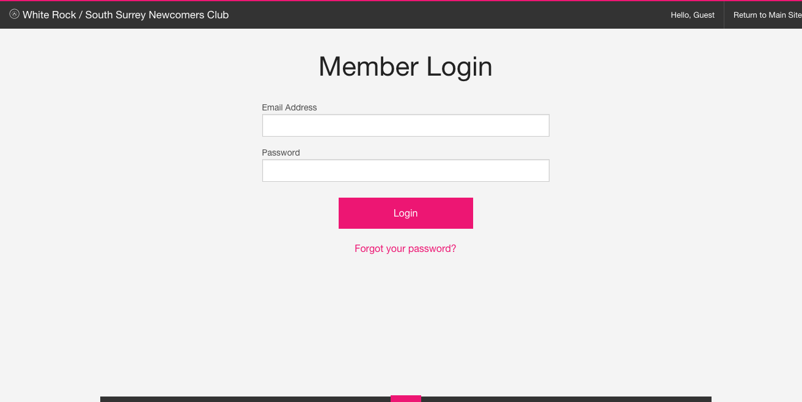
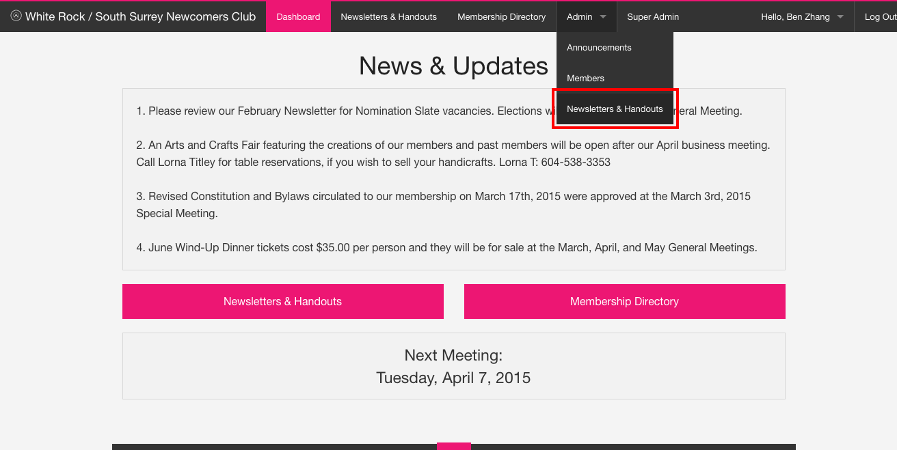
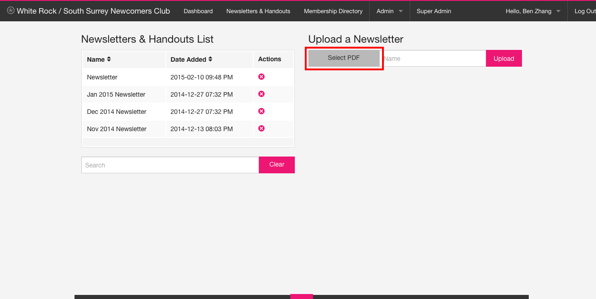
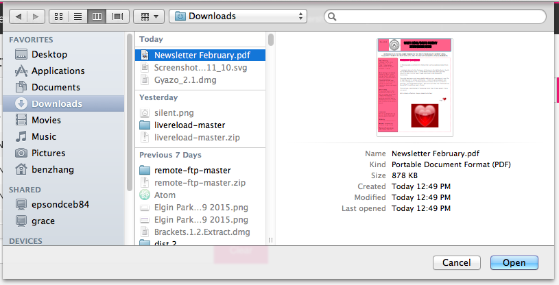
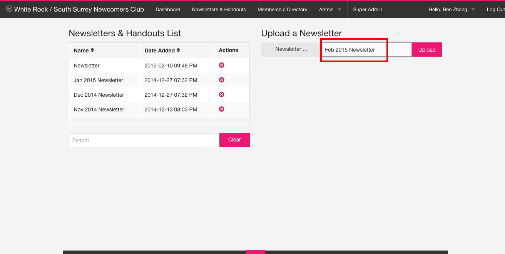
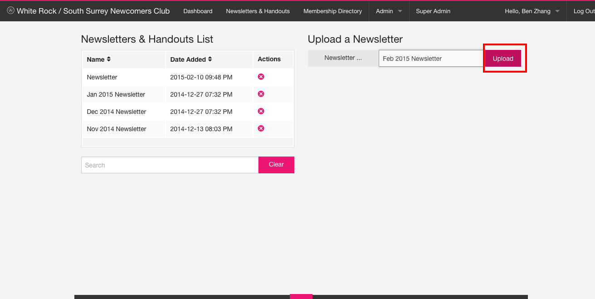
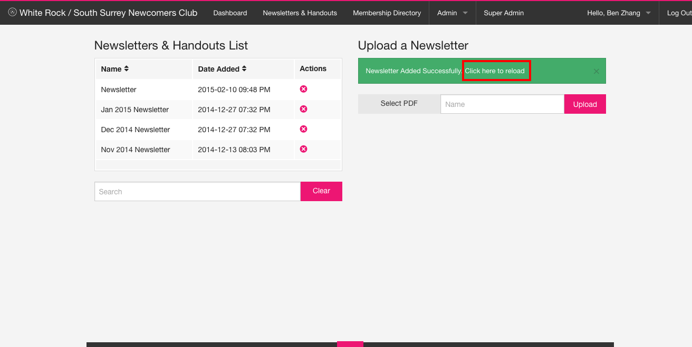
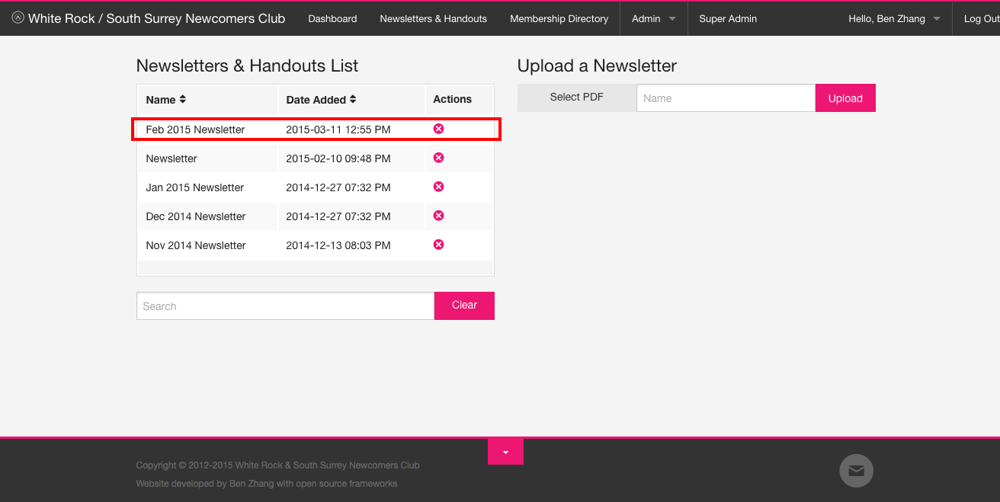

#Uploading a Newsletter
This document contains instructions for uploading a newsletter through the members' area.

##Step 1 - Login

##Step 2 - Navigate to the `Newsletters & Handouts` page

##Step 3 - Click `Select PDF`

##Step 4 - Select a `.pdf` file

##Step 5 - Add a name to the document

##Step 6 - Click the `Upload` button

##Step 7 - Refresh to see changes

##Step 8 - A new document should appear on the left

